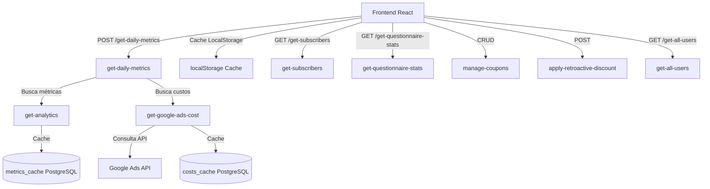

# MicroSaaS Metrics MVP 📊

Dashboard web para visualização de métricas de performance de um MicroSaaS, incluindo faturamento, custos de anúncios, ROAS e funil de conversão.

## 🎯 Sobre o Projeto

Este projeto migra um script Python local para uma solução web completa, integrando:

- **Frontend React** com dashboards interativos
- **Supabase Edge Functions** para processamento serverless
- **Google Ads API** para custos de publicidade
- **Sistema de cache** em duas camadas para otimização de performance

## 🏗️ Arquitetura

### Fluxo de Dados



### Componentes Principais

- **Frontend (React + TypeScript)**: Interface de usuário com dashboards, tabelas e gráficos
- **Supabase Edge Functions (Deno)**: Processamento serverless das requisições
- **PostgreSQL**: Banco de dados com tabelas de cache e dados de negócio
- **Google Ads API**: Integração para obter custos de publicidade

## 🛠️ Stack Tecnológico

### Frontend
- **Vite** - Build tool ultra-rápido
- **React 18** - Framework UI
- **TypeScript** - Type safety
- **shadcn/ui** - Componentes UI
- **Tailwind CSS** - Estilização
- **Recharts** - Gráficos interativos
- **date-fns** - Manipulação de datas
- **React Router** - Roteamento
- **TanStack Query** - Gerenciamento de estado e cache

### Backend
- **Supabase** - Backend as a Service
- **Edge Functions (Deno)** - Serverless functions
- **PostgreSQL** - Banco de dados
- **Google Ads API** - Integração de custos

## 📁 Estrutura do Projeto

```
microsaas-metrics-mvp/
├── src/
│   ├── components/
│   │   ├── dashboard/          # Componentes do dashboard (KPIs, gráficos, tabela)
│   │   ├── subscribers/         # Componentes de assinantes (gráfico de questionário)
│   │   ├── ui/                  # Componentes shadcn/ui
│   │   ├── Navigation.tsx      # Navegação principal
│   │   └── NavLink.tsx          # Link de navegação
│   ├── hooks/
│   │   └── useMetrics.ts       # Hook customizado para buscar métricas
│   ├── pages/
│   │   ├── Index.tsx           # Dashboard principal
│   │   ├── Subscribers.tsx      # Página de assinantes
│   │   ├── Coupons.tsx          # Gestão de cupons
│   │   ├── Export.tsx           # Exportação de dados
│   │   ├── Login.tsx            # Página de login
│   │   └── Signup.tsx           # Página de cadastro (convites)
│   ├── services/
│   │   ├── auth.ts              # Cliente Supabase para autenticação
│   │   └── supabase.ts          # Serviço de API (fetchDailyMetrics)
│   ├── types/
│   │   └── metrics.ts            # Tipos TypeScript
│   ├── utils/
│   │   ├── cache.ts             # Utilitários de cache (localStorage)
│   │   ├── dataAggregation.ts   # Agregação de dados
│   │   └── questionnaireLabels.ts # Labels do questionário
│   ├── App.tsx                   # Componente raiz com roteamento
│   └── main.tsx                  # Entry point
├── supabase/
│   ├── functions/                # Edge Functions
│   │   ├── get-daily-metrics/   # Orquestrador principal de métricas
│   │   ├── get-google-ads-cost/  # Busca custos do Google Ads
│   │   ├── get-subscribers/      # Lista de assinantes
│   │   ├── get-questionnaire-stats/ # Estatísticas do questionário
│   │   ├── manage-coupons/       # CRUD de cupons
│   │   ├── apply-retroactive-discount/ # Aplica desconto retroativo
│   │   └── get-all-users/       # Exportação de usuários
│   └── migrations/               # Migrations SQL
│       └── 20250126000001_create_cache_tables.sql
└── public/                       # Arquivos estáticos
```

## 🚀 Instalação e Setup

### Pré-requisitos

- Node.js 18+ e npm
- Conta Supabase (projeto: `iwovfvrmjaonzqlaavmi`)
- Credenciais do Google Ads API
- Supabase CLI instalado globalmente

### Instalação Local

```sh
# 1. Clone o repositório
git clone <YOUR_GIT_URL>
cd microsaas-metrics-mvp

# 2. Instale as dependências
npm install

# 3. Configure as variáveis de ambiente
# Crie o arquivo .env.local na raiz do projeto (veja seção Configuração)

# 4. Inicie o servidor de desenvolvimento
npm run dev
```

### Configuração do Backend

**⚠️ IMPORTANTE:** Antes de usar o frontend, você precisa fazer o deploy das Edge Functions no Supabase.

**Passos:**

1. **Instalar Supabase CLI:**
   ```bash
   npm install -g supabase
   ```

2. **Linkar projeto:**
   ```bash
   supabase link --project-ref iwovfvrmjaonzqlaavmi
   ```

3. **Criar tabelas de cache:**
   ```bash
   supabase db push
   ```

4. **Configurar secrets do Google Ads:**
   ```bash
   supabase secrets set GOOGLE_ADS_DEVELOPER_TOKEN=seu_token
   supabase secrets set GOOGLE_ADS_CLIENT_ID=seu_client_id
   supabase secrets set GOOGLE_ADS_CLIENT_SECRET=seu_client_secret
   supabase secrets set GOOGLE_ADS_REFRESH_TOKEN=seu_refresh_token
   supabase secrets set GOOGLE_ADS_CUSTOMER_ID=seu_customer_id
   ```
   
   Ou configure via Dashboard do Supabase: Settings → Edge Functions → Secrets

5. **Deploy das Edge Functions:**
   ```bash
   supabase functions deploy
   ```

## ⚙️ Configuração

### Variáveis de Ambiente (Frontend)

Crie `.env.local` na raiz do projeto:

```env
VITE_SUPABASE_URL=https://iwovfvrmjaonzqlaavmi.supabase.co
VITE_SUPABASE_ANON_KEY=sua_anon_key_aqui
```

**Como obter a Anon Key:**
1. Acesse: https://supabase.com/dashboard/project/iwovfvrmjaonzqlaavmi/settings/api
2. Copie o valor de "anon" / "public"

### Secrets do Supabase (Backend)

As seguintes variáveis devem ser configuradas como secrets no Supabase:

- `GOOGLE_ADS_DEVELOPER_TOKEN` - Token de desenvolvedor do Google Ads
- `GOOGLE_ADS_CLIENT_ID` - Client ID OAuth2
- `GOOGLE_ADS_CLIENT_SECRET` - Client Secret OAuth2
- `GOOGLE_ADS_REFRESH_TOKEN` - Refresh Token OAuth2
- `GOOGLE_ADS_CUSTOMER_ID` - ID da conta do Google Ads
- `BASE_PRICE` (opcional) - Preço base do produto (padrão: 12.90)

## 🎨 Funcionalidades

### Dashboard (`/`)

Página principal com visualização de métricas de performance:

- **KPIs Principais**: Faturamento total, Gasto em anúncios, ROAS médio, Pagamentos aprovados
- **Gráfico de Faturamento**: Revenue vs Ad Spend com indicador de ROAS
- **Gráfico de Lucro**: Profit ao longo do tempo
- **Funil de Conversão**: Forms Submitted → Payments Initiated → Payments Approved
- **Tabela Detalhada**: Métricas diárias com todas as informações
- **Filtros de Data**: Hoje, Ontem, 7/14/30 dias, Histórico (90 dias), Personalizado
- **Cache Inteligente**: Dados históricos cacheados, dia atual sempre atualizado

### Assinantes (`/subscribers`)

Gestão e visualização de assinantes:

- **Lista de Assinantes**: Tabela paginada com informações completas
- **Busca**: Por nome, email, cupom ou campanha
- **Estatísticas do Questionário**: Gráficos de distribuição das respostas (9 questões)
- **Informações Exibidas**: Nome, email, idade, link do teste, cupom usado, campanha, valor pago, data
- **Idade Média**: Exibida no cabeçalho

### Cupons (`/coupons`)

Gestão completa de cupons de desconto:

- **CRUD Completo**: Criar, editar, ativar/desativar e excluir cupons
- **Campos**: Código, desconto (%), descrição, data de expiração, máximo de usos, status
- **Cálculo de Desconto**: Modo porcentagem ou valor final
- **Ferramentas Admin**:
  - **Gerar Link com Cupom**: Cria link de pagamento com cupom pré-aplicado
  - **Aplicar Desconto Retroativo**: Aplica cupom a testes/pagamentos já realizados
- **Busca**: Por código do cupom
- **Status**: Ativo, Inativo, Expirado, Esgotado

### Exportação (`/export`)

Exportação de dados dos usuários:

- **Filtros de Data**: Mesmos filtros do dashboard
- **Formato**: Arquivo ZIP contendo CSV e JSON
- **Dados Exportados**: Nome, email, idade, status de pagamento, valor pago, cupom usado
- **Paginação Automática**: Processa todos os registros em lotes
- **Compatibilidade**: CSV com BOM UTF-8 para Excel

## 🔌 Edge Functions

O projeto utiliza 7 Edge Functions no Supabase:

### 1. `get-daily-metrics`
**Orquestrador principal** - Combina métricas e custos

- **Método**: POST
- **Endpoint**: `/functions/v1/get-daily-metrics`
- **Request**: `{ start_date: "YYYY-MM-DD", end_date: "YYYY-MM-DD" }`
- **Response**: Array de métricas diárias com revenue, cost, profit, ROAS, conversões
- **Funcionalidade**: 
  - Busca métricas do `get-analytics` (sem cache)
  - Busca custos do `get-google-ads-cost` (com cache)
  - Combina dados e calcula ROAS e profit
  - Processa em batches de 5 dias para otimização

### 2. `get-google-ads-cost`
**Busca custos do Google Ads**

- **Método**: POST
- **Endpoint**: `/functions/v1/get-google-ads-cost`
- **Request**: `{ date: "YYYY-MM-DD" }` ou `{ start_date, end_date }`
- **Response**: Custos em reais e micros
- **Funcionalidade**:
  - Consulta Google Ads API usando GAQL
  - Cache em PostgreSQL (`costs_cache`)
  - Suporta range de até 90 dias (limite da API)

### 3. `get-subscribers`
**Lista de assinantes paginada**

- **Método**: GET
- **Endpoint**: `/functions/v1/get-subscribers?page=1&limit=50&search=termo`
- **Response**: Array de assinantes com paginação
- **Funcionalidade**: Busca assinantes com informações de teste, pagamento e cupom

### 4. `get-questionnaire-stats`
**Estatísticas do questionário contextual**

- **Método**: GET
- **Endpoint**: `/functions/v1/get-questionnaire-stats?question=q1&getAll=true`
- **Response**: Estatísticas de distribuição das respostas
- **Funcionalidade**: Processa respostas do questionário contextual dos assinantes

### 5. `manage-coupons`
**CRUD de cupons**

- **Métodos**: GET, POST, PATCH, DELETE
- **Endpoint**: `/functions/v1/manage-coupons`
- **Funcionalidade**: Gerenciamento completo de cupons de desconto

### 6. `apply-retroactive-discount`
**Aplica desconto retroativo**

- **Método**: POST
- **Endpoint**: `/functions/v1/apply-retroactive-discount`
- **Request**: `{ test_id: "uuid", coupon_code: "CODIGO" }`
- **Funcionalidade**: Aplica cupom a teste/pagamento já realizado, recalcula valor

### 7. `get-all-users`
**Exportação de usuários**

- **Método**: GET
- **Endpoint**: `/functions/v1/get-all-users?limit=1000&cursor=xxx&startDate=...&endDate=...`
- **Response**: Array de usuários com paginação cursor-based
- **Funcionalidade**: Busca todos os usuários que fizeram o teste para exportação

## 💾 Sistema de Cache

O sistema utiliza cache em **duas camadas** para otimização:

### Cache Frontend (localStorage)

- **Localização**: `src/utils/cache.ts`
- **Duração**: 24 horas
- **Estratégia**:
  - **Range histórico** (termina antes de hoje): Cache completo por 24h
  - **Range incluindo hoje**: Cache incremental
    - Histórico até ontem: cacheado por 24h
    - Dia atual: sempre busca dados frescos (nunca cacheado)
- **Chave**: `metrics_cache_{startDate}_{endDate}`

### Cache Backend (PostgreSQL)

- **Tabelas**: `metrics_cache` e `costs_cache`
- **Localização**: `supabase/migrations/20250126000001_create_cache_tables.sql`
- **Estratégia**:
  - **Custos do Google Ads**: Cacheados em `costs_cache` por data
  - **Métricas do Analytics**: Cacheadas em `metrics_cache` (se aplicável)
  - **Dia atual**: Nunca cacheado (sempre busca dados atualizados)

### Regras Especiais

1. **Dia atual nunca é cacheado**: Garante dados sempre atualizados
2. **Cache incremental**: Para ranges incluindo hoje, combina histórico cacheado + dia atual
3. **Limpeza automática**: Cache antigo é removido automaticamente após expiração

## 🔐 Autenticação

### Sistema de Login

- **Página**: `/login`
- **Método**: Email e senha via Supabase Auth
- **Proteção**: Todas as rotas (exceto `/login` e `/signup`) requerem autenticação

### Sistema de Convites

- **Página**: `/signup`
- **Método**: Convites via hash URL (`#type=invite`)
- **Fluxo**:
  1. Admin gera link de convite no Supabase Dashboard
  2. Link contém token de autenticação no hash
  3. Usuário acessa `/signup` com o hash
  4. Sistema valida token e permite definir senha
  5. Após definir senha, usuário é autenticado automaticamente

### Proteção de Rotas

- Rotas protegidas redirecionam para `/login` se não autenticado
- Sessão persistida via Supabase Auth
- Logout disponível na navegação

## 🚀 Deploy

### Frontend

O frontend pode ser deployado em qualquer plataforma que suporte aplicações Vite/React:

**Vercel (Recomendado):**
```bash
npm run build
vercel deploy
```

**Lovable:**
1. Acesse: [Lovable Project](https://lovable.dev/projects/eb35af2d-58a9-410d-87fb-5b2a959a1c11)
2. Clique em **Share → Publish**

**Configuração no Deploy:**
- Adicione as variáveis de ambiente `VITE_SUPABASE_URL` e `VITE_SUPABASE_ANON_KEY`
- Configure `vercel.json` para SPA routing (já incluído)

### Backend (Supabase)

```bash
# Deploy de todas as Edge Functions
supabase functions deploy

# Deploy de uma function específica
supabase functions deploy get-daily-metrics
```

**Verificar Deploy:**
- Acesse: https://supabase.com/dashboard/project/iwovfvrmjaonzqlaavmi/functions
- Verifique se todas as functions estão deployadas e ativas

## 🧪 Desenvolvimento Local

### Testar Edge Functions Localmente

```bash
# Iniciar Supabase local
supabase start

# Servir functions localmente
supabase functions serve

# Testar endpoint
curl -X POST 'http://localhost:54321/functions/v1/get-daily-metrics' \
  -H "Authorization: Bearer YOUR_LOCAL_ANON_KEY" \
  -H "Content-Type: application/json" \
  -d '{"start_date": "2025-01-15", "end_date": "2025-01-17"}'
```

### Scripts Disponíveis

```bash
npm run dev          # Inicia servidor de desenvolvimento
npm run build        # Build de produção
npm run build:dev    # Build em modo desenvolvimento
npm run preview      # Preview do build de produção
npm run lint         # Executa ESLint
```

## 🐛 Troubleshooting

### Erro: "Missing Supabase environment variables"
- Verifique se o arquivo `.env.local` existe na raiz
- Certifique-se de que as variáveis começam com `VITE_`
- Reinicie o servidor de desenvolvimento após criar/editar `.env.local`

### Erro: "Failed to fetch metrics"
- Verifique se as Edge Functions foram deployadas: `supabase functions list`
- Teste os endpoints diretamente via curl ou Postman
- Verifique os logs no Supabase Dashboard: Edge Functions → Logs
- Confirme que `get-analytics` está disponível (pode ser function externa)

### Dados não aparecem
- Certifique-se de que o período selecionado tem dados
- Verifique se as credenciais do Google Ads estão corretas nos secrets
- Limpe o cache: Botão "Hard refresh" no dashboard ou `localStorage.clear()`
- Verifique os logs das Edge Functions no Supabase Dashboard

### Erro de autenticação
- Verifique se a sessão não expirou (faça logout e login novamente)
- Confirme que o usuário tem permissões no Supabase
- Verifique os logs de autenticação no Supabase Dashboard

### Cache não está funcionando
- Verifique se as tabelas `metrics_cache` e `costs_cache` foram criadas: `supabase db push`
- Confirme que RLS (Row Level Security) está configurado corretamente
- Verifique os logs do Supabase para erros de acesso ao banco

### Google Ads API retorna erro
- Verifique se todos os secrets estão configurados corretamente
- Confirme que o `GOOGLE_ADS_CUSTOMER_ID` está correto (sem hífens)
- Verifique se o token de desenvolvedor está ativo
- Confirme que a conta do Google Ads tem acesso à API

## 📚 Recursos Adicionais

- [Documentação do Supabase](https://supabase.com/docs)
- [Documentação do Google Ads API](https://developers.google.com/google-ads/api/docs/start)
- [Documentação do React](https://react.dev)
- [Documentação do Vite](https://vitejs.dev)

## 🤝 Contribuindo

Este é um projeto privado. Para contribuir:

1. Crie uma branch: `git checkout -b feature/minha-feature`
2. Commit suas mudanças: `git commit -m 'feat: minha feature'`
3. Push para a branch: `git push origin feature/minha-feature`
4. Abra um Pull Request

## 📞 Suporte

Para dúvidas ou problemas:

1. Verifique esta documentação
2. Verifique os logs das Edge Functions no Supabase Dashboard
3. Entre em contato com o time de desenvolvimento

---

**Última atualização:** Janeiro 2025
