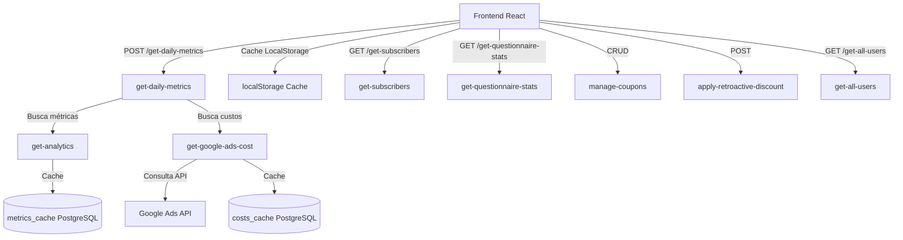

# Arquitetura do Dashboard

Dashboard web para visualização de métricas de performance de um MicroSaaS (faturamento, custos de anúncios, ROAS, funil de conversão). Este projeto migra um script Python local para uma solução web completa.

## Componentes principais

- **Frontend (React + TypeScript)**: Interface com dashboards, tabelas e gráficos
- **Supabase Edge Functions (Deno)**: Processamento serverless das requisições
- **PostgreSQL**: Banco de dados com tabelas de cache e dados de negócio
- **Google Ads API**: Integração para custos de publicidade

## Fluxo de dados



## Stack tecnológico

### Frontend
- Vite, React 18, TypeScript, shadcn/ui, Tailwind CSS, Recharts, date-fns, React Router, TanStack Query

### Backend
- Supabase (Backend as a Service), Edge Functions (Deno), PostgreSQL, Google Ads API

## Estrutura do projeto

```
apps/dashboard/
├── src/
│   ├── components/
│   │   ├── dashboard/          # KPIs, gráficos, tabela
│   │   ├── subscribers/        # Gráfico de questionário
│   │   └── ui/                 # shadcn/ui
│   ├── hooks/                  # useMetrics.ts
│   ├── pages/                  # Index, Subscribers, Coupons, Export, Login, Signup
│   ├── services/               # auth.ts, supabase.ts
│   ├── types/                  # metrics.ts
│   └── utils/                  # cache, dataAggregation, questionnaireLabels
├── supabase/
│   ├── functions/              # Edge Functions
│   └── migrations/             # Tabelas de cache
└── public/
```
